# Entity-Relationship Diagrams

The full, authoritative schema is `apps/api/prisma/schema.prisma` (~50 models). These diagrams group it by domain for readability — relationships only, not every field. Generate an up-to-date version anytime with `pnpm --filter api exec prisma-erd-generator` style tooling if you add one, or just read the schema file directly; it's organized with the same domain-section comments used here.

## Core: Auth / RBAC / Audit

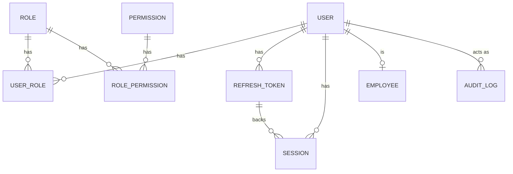

## Org Structure

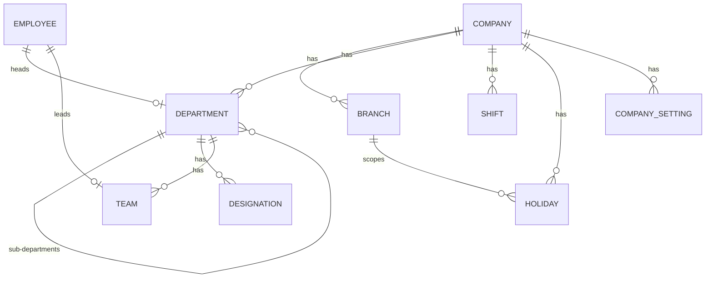

## Employee

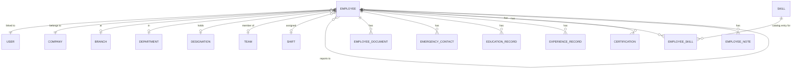

## Attendance

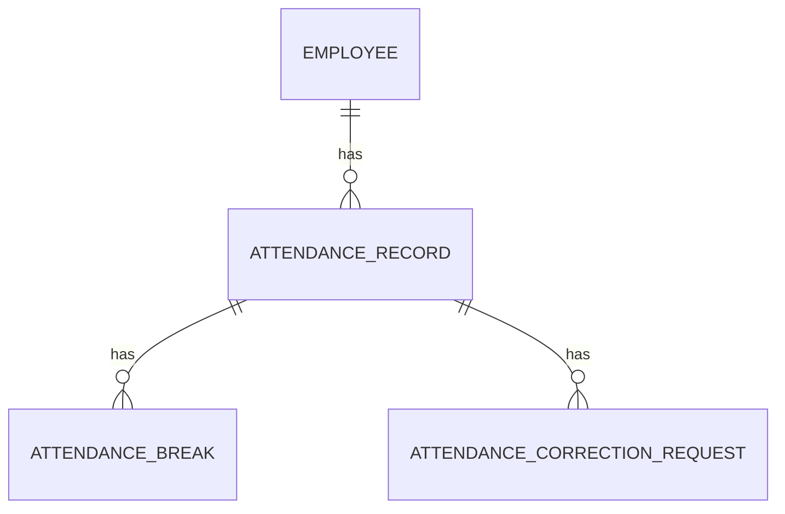

## Leave

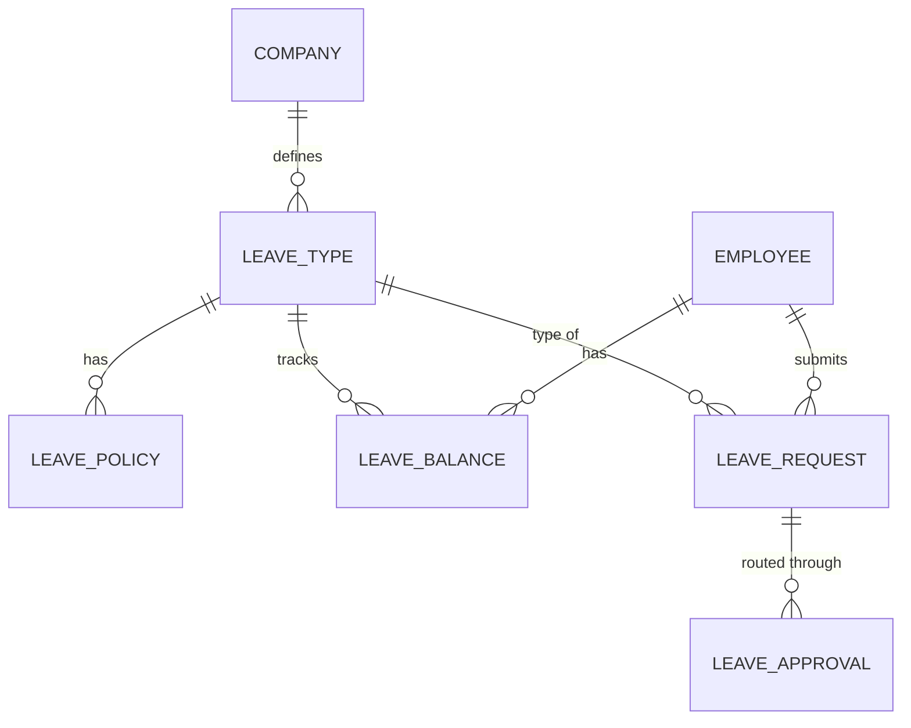

## Payroll

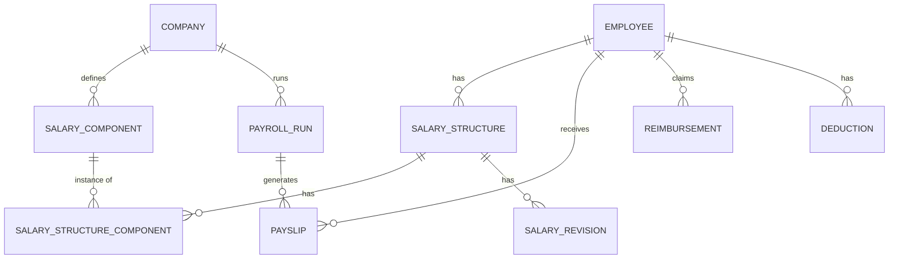

## Performance

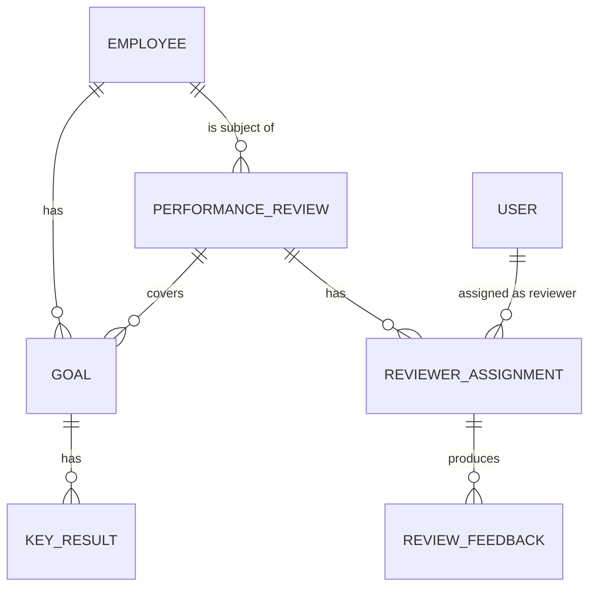

## Timesheet / Projects

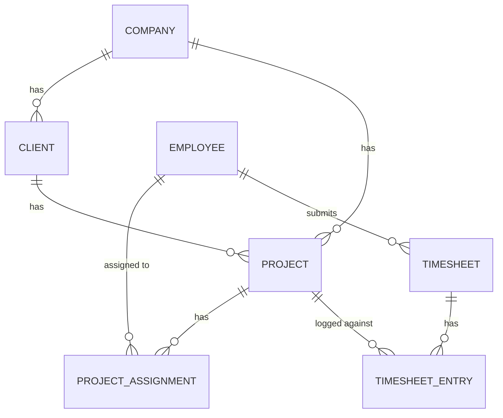

## Assets

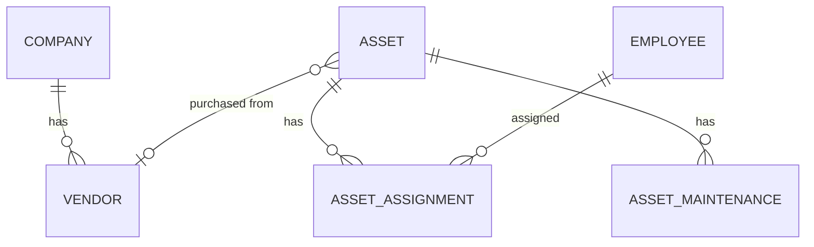

## Exit Management

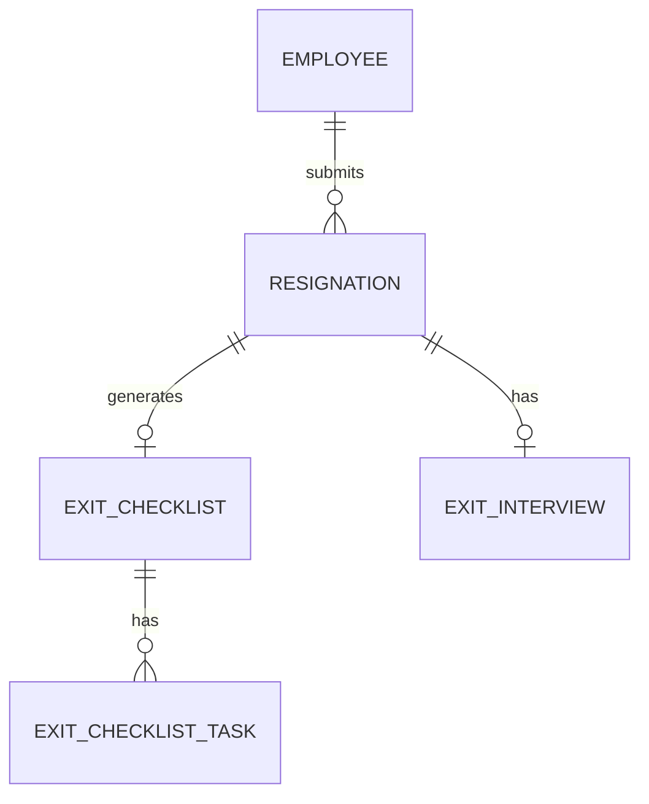

## Recruitment

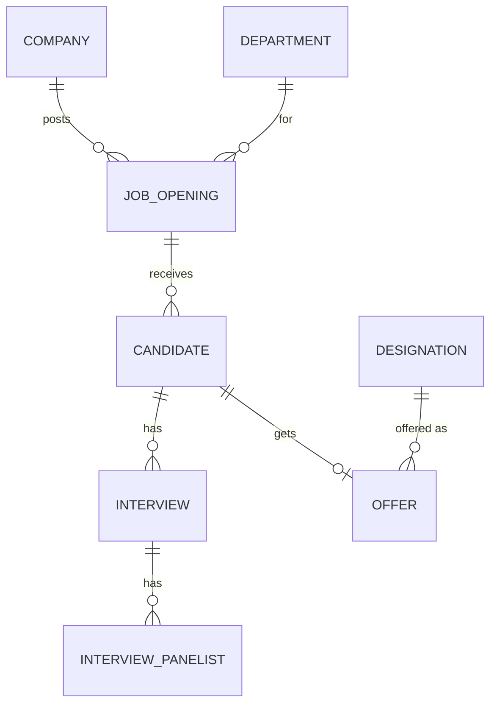

## Onboarding

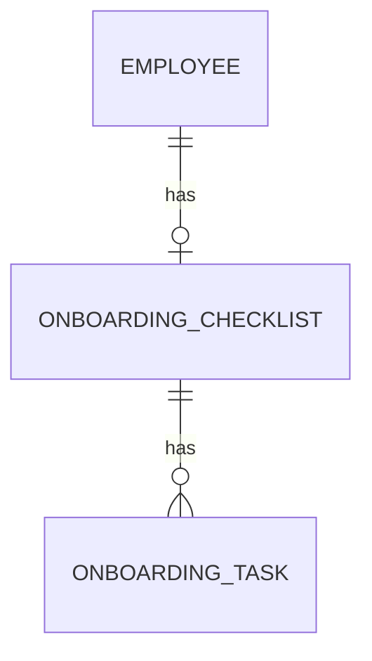

## Helpdesk

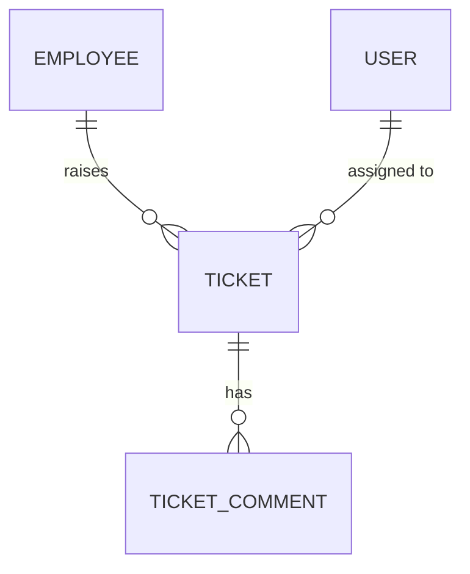

## Learning

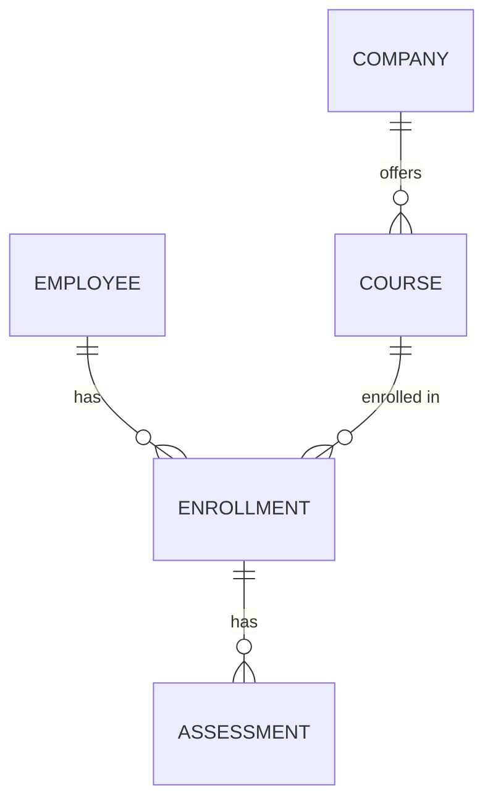

## Expense / Travel

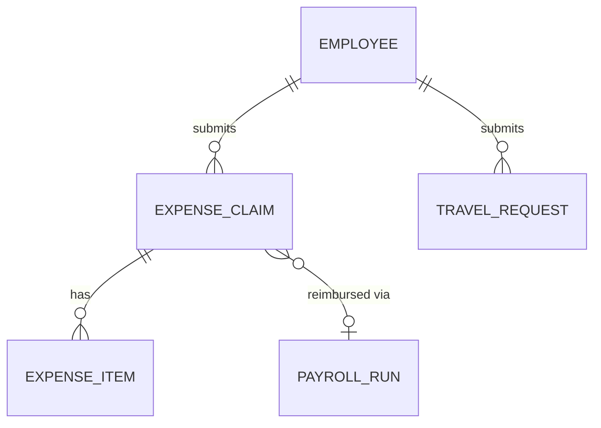

## Documents / Notifications

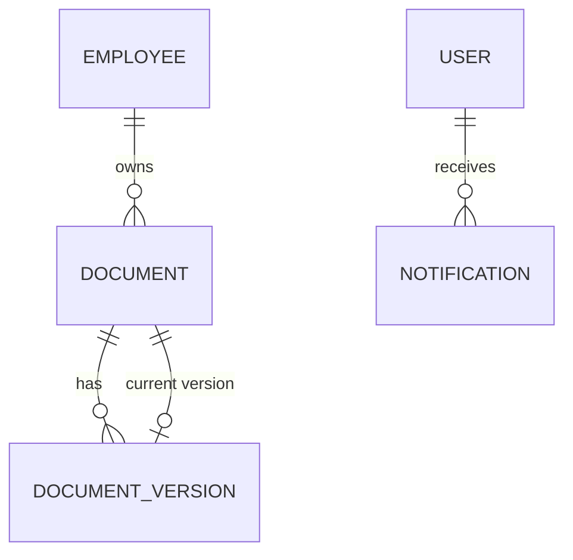
